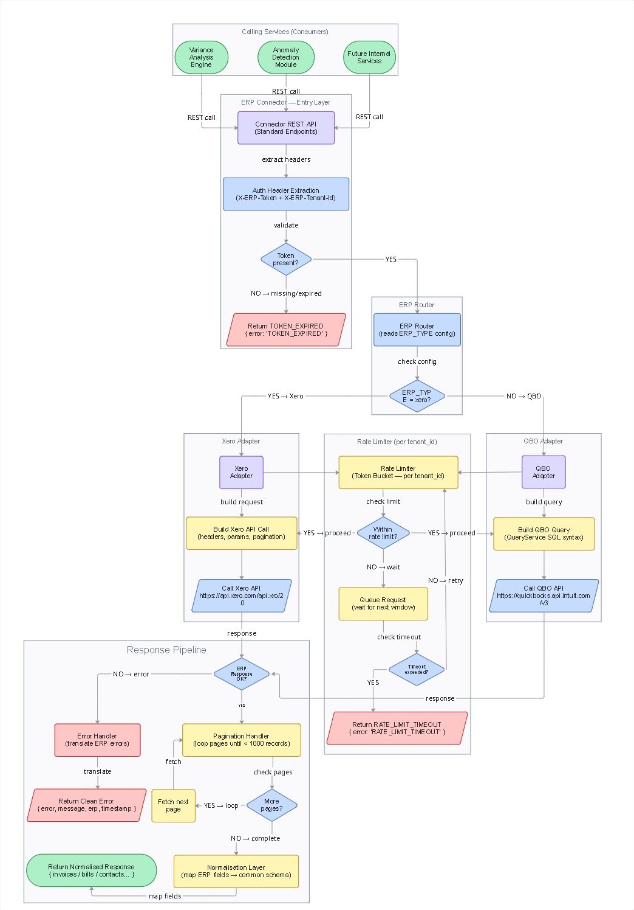

# ERP Connector

> **Stateless REST microservice that acts as a universal wrapper around Xero and QuickBooks Online (QBO).**  
> Internal services talk to one clean, ERP-agnostic API. The connector handles all ERP quirks internally.

---

## Table of Contents
1. [Project Overview](#project-overview)
2. [Tech Stack](#tech-stack)
3. [Project Structure](#project-structure)
4. [Team & Ownership](#team--ownership)
5. [Getting Started](#getting-started)
6. [Environment Configuration](#environment-configuration)
7. [API Endpoints](#api-endpoints)
8. [Architecture](#architecture)
9. [Branch Strategy](#branch-strategy)
10. [Running Tests](#running-tests)
11. [Current Build Status](#current-build-status)

---

## Project Overview

The ERP Connector receives requests from internal services, routes them to the correct ERP adapter (Xero or QBO), normalises every response into one consistent schema, and returns clean structured data.

**What it does:**
- Accepts ERP-agnostic REST requests from internal services
- Reads active ERP from `ERP_TYPE` environment variable (set once at startup)
- Translates each request into the correct ERP-specific API call
- Handles pagination, rate limiting, and field-name differences internally
- Normalises every ERP response to a common schema
- Returns unified structured errors — never raw ERP messages
- Generates a `Correlation-ID` for every request for full traceability

**What it does NOT do:**
- Store any data (stateless, no database)
- Hold, manage, or refresh OAuth tokens (caller owns credentials)
- Run background jobs or handle webhooks (future phase)

---

## Tech Stack

| Layer | Technology |
|-------|-----------|
| Language | Python 3.13 |
| Framework | FastAPI |
| ASGI Server | Uvicorn |
| HTTP Client | httpx (async) |
| Validation | Pydantic v2 |
| Config | python-dotenv |
| Testing | pytest + pytest-asyncio |
| Version Control | Git / GitHub |

---

## Project Structure

```
erp_connector/
├── main.py                        # FastAPI app entry point, middleware, exception handlers
├── .env                           # Local secrets (gitignored — never commit)
├── .env.example                   # Template with all required keys
├── .gitignore
├── requirements.txt
│
├── adapters/
│   ├── __init__.py                # Adapter registry — get_adapter() factory  ← Dev 1 ✅
│   ├── base_adapter.py            # Abstract interface all adapters must implement  ← Dev 1 ✅
│   ├── xero.py                    # Xero adapter implementation  ← Dev 2 🔄
│   └── qbo.py                     # QBO adapter implementation  ← Dev 3 🔄
│
├── config/
│   ├── __init__.py
│   └── settings.py                # Loads & validates env vars at startup  ← Dev 1 ✅
│
├── models/
│   ├── __init__.py
│   └── schemas.py                 # Frozen Pydantic models (READ-ONLY contract)  ← Dev 1 ✅
│
├── routes/
│   ├── __init__.py
│   └── erp.py                     # All 12 API route stubs with OpenAPI tags  ← Dev 1 ✅
│
├── utils/
│   ├── __init__.py
│   ├── errors.py                  # Unified error builder & exception handlers  ← Dev 1 ✅
│   ├── logger.py                  # Structured JSON logging, no token leakage  ← Dev 1 ✅
│   ├── rate_limiter.py            # Token-bucket rate limiter per tenant  ← Dev 1 ✅
│   └── pagination.py              # Pagination utility (placeholder)
│
└── tests/
    ├── unit/
    │   ├── test_errors.py
    │   ├── test_rate_limiter.py
    │   ├── test_pagination.py
    │   └── test_schemas.py
    └── integration/
        ├── test_health.py         ← ✅ Passing
        ├── test_invoices.py
        ├── test_bills.py
        ├── test_contacts.py
        ├── test_accounts.py
        ├── test_payments.py
        └── test_error_handling.py
```

---

## Team & Ownership

| Developer | Role | Owns |
|-----------|------|------|
| **Mithilesh Kolhapurkar** | Core Engine | `main.py`, `config/`, `models/schemas.py`, `routes/`, `utils/`, `adapters/__init__.py`, `adapters/base_adapter.py` |
| **Ankita Patil** | QBO Adapter | `adapters/qbo.py` only |
| **Samreen Shaikh** | Xero Adapter | `adapters/xero.py` only |


---

## Getting Started

### Prerequisites
- Python 3.11+
- pip

### Installation

```bash
# 1. Clone the repository
git clone https://github.com/MITHILESHK11/ERP_Connector.git
cd ERP_Connector

# 2. Create and activate a virtual environment
python -m venv .venv
.venv\Scripts\activate        # Windows
# source .venv/bin/activate   # macOS/Linux

# 3. Install dependencies
pip install fastapi uvicorn python-dotenv httpx pytest pytest-asyncio

# 4. Copy the environment template
copy .env.example .env        # Windows
# cp .env.example .env        # macOS/Linux

# 5. Edit .env and fill in your ERP_TYPE and tokens
```

### Run the server

```bash
uvicorn main:app --reload --port 8000
```

**Swagger UI** → [http://localhost:8000/erp/docs](http://localhost:8000/erp/docs)

---

## Environment Configuration

| Variable | Required | Default | Description |
|----------|----------|---------|-------------|
| `ERP_TYPE` | ✅ Yes | — | Must be `xero` or `quickbooks`. Fails at startup if missing. |
| `PORT` | No | `8000` | Server port |
| `LOG_LEVEL` | No | `INFO` | `DEBUG` / `INFO` / `WARNING` / `ERROR` |
| `CORS_ORIGIN` | No | `*` | Restrict in production |
| `APP_VERSION` | No | `0.1.0` | Reported in `/erp/health` |
| `XERO_TOKEN` | For Xero | — | OAuth 2.0 access token (30-min expiry) |
| `XERO_TENANT_ID` | For Xero | — | Xero Organisation UUID |
| `QBO_TOKEN` | For QBO | — | Intuit OAuth 2.0 access token (~60-min expiry) |
| `QBO_REALM_ID` | For QBO | — | QuickBooks Online Company/Realm ID |


---

## API Endpoints

All endpoints require two custom headers (except `/erp/health`):

| Header | Description |
|--------|-------------|
| `X-ERP-Token` | OAuth 2.0 Bearer access token |
| `X-ERP-Tenant-Id` | Xero `tenantId` or QBO `realmId` |

### Health

| Method | Endpoint | Auth | Description |
|--------|----------|------|-------------|
| `GET` | `/erp/health` | ❌ | Liveness check. Returns ERP type and version. |

### Invoices

| Method | Endpoint | Description |
|--------|----------|-------------|
| `GET` | `/erp/invoices` | List invoices. Query: `from`, `to`, `status` |
| `GET` | `/erp/invoices/{invoice_id}` | Get one invoice by ID |
| `POST` | `/erp/invoices` | Create a new invoice |

### Bills

| Method | Endpoint | Description |
|--------|----------|-------------|
| `GET` | `/erp/bills` | List bills. Query: `from`, `to` |
| `GET` | `/erp/bills/{bill_id}` | Get one bill by ID |
| `POST` | `/erp/bills` | Create a new bill |

### Contacts

| Method | Endpoint | Description |
|--------|----------|-------------|
| `GET` | `/erp/contacts` | List contacts. Query: `type` (customer/supplier) |
| `GET` | `/erp/contacts/{contact_id}` | Get one contact by ID |
| `POST` | `/erp/contacts` | Create a new contact |

### Accounts

| Method | Endpoint | Description |
|--------|----------|-------------|
| `GET` | `/erp/accounts` | Full chart of accounts |

### Payments

| Method | Endpoint | Description |
|--------|----------|-------------|
| `POST` | `/erp/payments` | Record a payment against an invoice or bill |

### Response Envelope

**Success (list):**
```json
{
  "success": true,
  "erp": "xero",
  "correlationId": "req-abc-123",
  "count": 42,
  "data": [ ... ]
}
```

**Error:**
```json
{
  "success": false,
  "error": "TOKEN_EXPIRED",
  "message": "Access token has expired. Please refresh and retry.",
  "erp": "xero",
  "correlationId": "req-abc-123",
  "timestamp": "2026-06-23T08:00:00Z"
}
```

---

## Architecture



**Flow summary:**
1. **Calling Services** (Variance Analysis Engine, Anomaly Detection, etc.) make REST calls with `X-ERP-Token` + `X-ERP-Tenant-Id` headers.
2. **Entry Layer** validates headers — missing/expired token returns `TOKEN_EXPIRED` immediately.
3. **ERP Router** reads `ERP_TYPE` from config and routes to the correct adapter.
4. **Rate Limiter** (token bucket per `tenant_id`) checks limits before any API call — Xero: 60/min, QBO: 500/min. Requests are queued on breach, never dropped.
5. **Adapter** (Xero or QBO) builds the ERP-specific API call, handles pagination (loops until < 1000 records per page).
6. **Response Pipeline** — on error, translates to a clean `{ error, message, erp, timestamp }` response. On success, maps ERP fields to the common normalised schema and returns the result.

---

## Branch Strategy

| Branch | Purpose |
|--------|---------|
| `main` | Protected. Production-ready code only. |
| `dev1/` | Mithilesh Kolhapurkar — Core Engine |
| `dev2/` | Ankita Patil — QBO Adapter |
| `dev3/` | Samreen Shaikh — Xero Adapter |

PRs from `dev*/` branches must be reviewed before merging to `main`.

---

## Running Tests

```bash
# Run the complete test suite (unit and integration tests)
pytest -v
```

| Test Suite | Status |
|------|--------|
| All Unit & Integration Tests (46/46) | ✅ Passing |

---

## Current Build Status

| Component | Status |
|-----------|--------|
| Project scaffold (33 files) | ✅ Complete |
| `models/schemas.py` (frozen contract) | ✅ Complete — READ-ONLY |
| `config/settings.py` | ✅ Complete |
| `adapters/base_adapter.py` | ✅ Complete |
| `adapters/__init__.py` (registry) | ✅ Complete |
| `utils/` (logger, errors, rate_limiter) | ✅ Complete |
| `main.py` (app, middleware) | ✅ Complete |
| `routes/erp.py` (13 routes including PUT) | ✅ Complete |
| `adapters/xero.py` | 🔄 Dev 2 — In Progress |
| `adapters/qbo.py` (QuickBooks Online) | ✅ Complete |
| Integration tests / Unit tests | ✅ Complete & Passing |

---

*ERP Connector — Phase 0 | Python FastAPI | June 2026*

